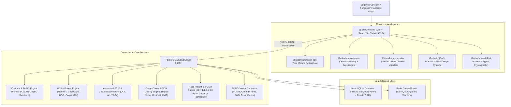

# Atlas Logistics System Architecture

This document provides a comprehensive overview of the architecture, component topology, data persistence, and deterministic calculation engines powering **Atlas Logistics ERP**.

---

## 1. High-Level Architectural Model

Atlas Logistics employs a **Hybrid Micro-Frontend and Fastify Backend** architecture designed for ultra-low latency, zero operational cloud costs ($0 local architecture), and full compliance with international freight forwarding regulations.

---

## 2. Monorepo Topology (Turborepo & pnpm Workspaces)

The codebase is organized into modular packages using `pnpm` workspaces:

| Package | Role | Key Technologies |
|---|---|---|
| **`packages/frontend`** | Main Host Super-App | React 19, Vite 8, React Router 7, TanStack Query, TailwindCSS |
| **`packages/dashboard`** | Operational analytics & KPIs | React 19, Lucide, Recharts |
| **`packages/rate-comparer`** | Multi-carrier ocean/air freight rating | Dynamic rate matrices, BAF/CAF surcharges |
| **`packages/bpmn-modeler`** | Business process modeler & versioning | BPMN 2.0 XML parser, canvas designer |
| **`packages/warehouse-ops`** | Warehouse digital twin & dock traffic | 3D & 2.5D visual rack & pallet management |
| **`packages/ui`** | Reusable design system | Glassmorphism styling tokens, buttons, modal wrappers |
| **`packages/shared`** | Shared utilities and cryptographic security | Zod schemas, DOMPurify, timingSafeEqual |

---

## 3. Backend & API Services (Fastify 5)

The server runtime is built on **Fastify 5**, providing high throughput and native plugin modularity:

- **Authentication & RBAC**: `@fastify/jwt` handles session validation and role authorization across `ADMIN`, `MANAGER`, `OPERATIONS`, `EXECUTIVE`, `SALES`, `CUSTOMER`, and `DRIVER`.
- **Real-Time WebSockets**: `@fastify/websocket` broadcasts instantaneous dispatch, customs status updates, and demurrage alerts.
- **REST Endpoints**:
  - `/api/auth`: Login, user registration, role validation.
  - `/api/customs-declarations`: 54-box DUA declarations, TARIC calculations, DUA XML/PDF.
  - `/api/air-cargo`: e-AWB, Modulo-7 validation, DGR screening, Cargo-XML/IMP.
  - `/api/incoterms`: 11-rule responsibility matrix, customs valuation normalizer, commercial contracts.
  - `/api/claims`: Cargo claims, statutory SDR caps, Carrier Protest Letters, Subrogation Receipts.
  - `/api/road-freight`: e-CMR consignments, ADR 1.1.3.6 points, trailer load %, Carta de Porte PDF.
  - `/api/treasury`: 3-Way Match reconciler, FX risk exposure, cash flow forecast, carrier dispute letters & settlement statements PDF.
  - `/api/cold-chain`: Datalogger telemetry (EN 12830), Arrhenius MKT calculator, Dry Ice holdover, Reefer Genset fuel burn, GDP Release Certificate PDF.
  - `/api/cbam`: CBAM catalog, verified installations, embedded emissions calculation, Article 9 foreign carbon deductions, EU registry XML, and CBAM declaration certificate PDF.
  - `/api/rail`: Corridors TEN-T (RFC4/RFC6), terminals, rolling stock wagons, CIM consignments, train consists (750m), axle loads (EN 15528), braking percentage, ERA TAF-TSI XML, CIM PDF & Brake Sheet PDF.
  - `/api/customs-warehouse`: Facilities (DA/DDA/ADT/ZF), guarantees (AEAT GRN), inventory lots, official stock ledger, debt suspension & discharge tax settlement, DVD PDF, and Stock Certificate PDF.
  - `/api/fueleu`: Marine fuels, merchant vessels, voyages, compliance accounts, fleet pools (Art. 21), EU ETS liability & Green BAF per TEU, EMSA THETIS-MRV XML, FuelEU Compliance Certificate PDF & BDN PDF.
  - `/api/trade-finance`: Documentary credits (UCP 600), demand guarantees (URDG 758), collections (URC 522), discrepancy validation, fee simulator, SWIFT MT700/MT734, presentation dossiers PDF.
  - `/api/aeo-security`: AEO self-assessment audits (CAE DG TAXUD/AEAT), 7-point C-TPAT/OEAS container inspections, ISO 17712 security seals ledger, ISO 28000 partner risk matrices, 4 official PDF reports.
  - `/api/chartering`: Voyage & Time charter fixtures (Gencon 2022 / NYPE 2015), NOR & turn-time validation, SOF event chronology, laytime & demurrage/despatch computation (ATS/WTS), time charter off-hire audit, 4 maritime PDF documents.
  - `/api/general-average`: York-Antwerp Rules 2016 allowances (Rules I..XI, XX 2.5%, XXI CMI interest), contributory values, adjustment apportionment, Lloyd's Average Bond LAB 77, 4 marine casualty PDFs.
  - `/api/dangerous-goods`: IMDG 7.2.4 segregation matrix, ADR 1.1.3.6 1,000 points calculation, IATA DGR lithium battery classifier (UN 3480 CAO & SoC ≤30%), EmS emergency cards, IMO DGD & IATA DGD PDFs.

---

## 4. Deterministic Business & Regulatory Engines

All logistics calculations are 100% deterministic, executing strictly defined mathematical and legal formulas:

1. **Customs Valuation Normalization (EU UCC Art. 70–74)**:
   $$\text{CIF Customs Value} = \text{Invoice Price} + \text{Additions (Freight, Origin Terminal, Insurance)} - \text{Deductions (Post-Import Duty, Inland Freight)}$$
2. **IATA Modulo-7 Checksum Verification**:
   $$\text{Checksum} = \text{Serial Number (7 digits)} \pmod 7$$
3. **ADR 2025 Section 1.1.3.6 Small Load Exemption (Puntos ADR)**:
   $$\text{Total Points} = \sum (\text{Quantity (kg/L)} \times \text{Multiplier}) \le 1,000 \implies \text{Exempt from orange plates}$$
4. **Statutory International Carrier Liability Limits (SDR / DEG)**:
   - **Maritime (Hague-Visby)**: $\max(\text{Gross kg} \times 2.00, \; \text{Packages} \times 666.67) \times \text{Rate}_{\text{SDR}\to\text{EUR}}$
   - **Air Cargo (Montreal 1999)**: $\text{Gross kg} \times 22.00 \times \text{Rate}_{\text{SDR}\to\text{EUR}}$
   - **Road Freight (CMR)**: $\text{Gross kg} \times 8.33 \times \text{Rate}_{\text{SDR}\to\text{EUR}}$
   - **Rail Freight (CIM)**: $\text{Gross kg} \times 17.00 \times \text{Rate}_{\text{SDR}\to\text{EUR}}$
5. **Carrier Invoice 3-Way Match & Variance Tolerance Rule**:
   $$\text{Variance} = \text{Billed Amount} - \text{Expected Quote} \implies \text{Within Tolerance if } |\text{Variance}| \le 5.00 \text{ or } \frac{|\text{Variance}|}{\text{Expected}} \le 1.0\%$$
6. **Multi-Currency Treasury Unrealized FX Gain/Loss**:
   $$\text{Unrealized FX}_{\text{EUR}} = \left(\frac{\text{Net Exposure}_{\text{CCY}}}{\text{Spot Rate}_{\text{CCY}}}\right) - \left(\frac{\text{Net Exposure}_{\text{CCY}}}{\text{Book Rate}_{\text{CCY}}}\right)$$
7. **Arrhenius Mean Kinetic Temperature (MKT for Pharma GDP)**:
   $$T_K = \frac{\frac{\Delta H}{R}}{-\ln\left(\frac{\sum_{i=1}^{n} e^{-\frac{\Delta H}{R T_i}}}{n}\right)}, \quad \Delta H = 83.144\text{ kJ/mol}, \; R = 8.314472\text{ J/(mol}\cdot\text{K)}$$
8. **Reefer Genset Diesel Fuel Consumption**:
   $$\text{Fuel Burn Rate (L/hr)} = 1.8 + 0.08 \times |T_{\text{ambient}} - T_{\text{setpoint}}|$$
9. **CBAM Embedded Specific Emissions & Precursor Kinetics (EU Reg. 2023/956)**:
   $$SE_{\text{total}} = SE_{\text{direct}} + SE_{\text{indirect}} + \sum \left( \frac{\text{Masa Precursor } i}{\text{Masa Producto}} \times SE_{\text{precursor } i} \right)$$
   $$\text{Emisiones Integradas Totales } (\text{tCO}_2\text{e}) = \text{Masa Neta (t)} \times SE_{\text{total}}$$
10. **CBAM Article 9 Net Carbon Liability & Foreign Credit**:
    $$\text{Net Carbon Liability (€)} = \max\left(0, \; (\text{Total Embedded } \text{tCO}_2\text{e} \times P_{\text{EU ETS}}) - \text{Foreign Carbon Price Paid (€)}\right)$$
11. **TEN-T Rail Convoy Braking Percentage (UIC 992)**:
    $$\text{Brake } \% = \left( \frac{\sum \text{Braked Mass (t)}}{\text{Total Train Weight (t)}} \right) \times 100 \ge 65\%$$
12. **Customs Guarantee Available Balance (UCC Art. 89-98)**:
    $$\text{Credit Available} = \text{Guarantee Limit} - \sum (\text{Customs Duty Suspended} + \text{VAT Suspended})$$
13. **FuelEU Maritime Compliance Balance (EU Reg. 2023/1805)**:
    $$CB = (GHG_{\text{target}} - GHG_{\text{actual}}) \times \sum E_i \quad [\text{gCO}_2\text{eq}]$$
    $$\text{Penalty (€)} = \frac{|CB|}{GHG_{\text{actual}} \times 41,000} \times 2,400$$
14. **UCP 600 Letter of Credit Banking Fee Schedule**:
    $$\text{Total Fee} = \text{Issuance Fee} + \text{Confirmation Fee} + \text{Settlement Commission} + \text{Swift Transmissions}$$
15. **AEO CAE Compliance Scoring (UCC Art. 39)**:
    $$\text{Score}_{\text{Total}} = \sum_{b=1}^{6} (w_b \times S_b) \ge 80\% \implies \text{AEO Status Approved}$$
16. **BIMCO Laytime Allowed & Time Sheet Resolution**:
    $$\text{Laytime Allowed (Days)} = \frac{\text{Total Cargo (MT)}}{\text{Loading/Discharge Rate (MT/Day)}}$$
17. **Demurrage / Despatch Settlement (ATS vs WTS)**:
    $$\text{Demurrage Due} = \text{Demurrage Rate/Day} \times \text{Days Exceeded}$$
    $$\text{Despatch Due} = (\text{Demurrage Rate} \times 0.5) \times \text{Days Saved}$$
18. **Time Charter Net Hire Settlement**:
    $$\text{Net Payable} = (\text{Total Days} \times \text{Daily Hire}) - (\text{Off-Hire Days} \times \text{Daily Hire}) - \text{Bunker Offset} - \text{Commissions}$$
19. **General Average Apportionment & Rate of Contribution (York-Antwerp Rules 2016)**:
    $$GA_{\text{Total}} = \sum \text{Sacrificios} + \sum \text{Gastos Refugio} + \text{Salvamento LOF} + (0.025 \times \text{Desembolsos}) + \text{Intereses CMI}$$
    $$CV_{\text{Total}} = CV_{\text{Buque}} + CV_{\text{Flete}} + \sum CV_{\text{Carga CIF}} + CV_{\text{Contenedores}}$$
    $$\text{Tasa de Contribución } \% = \left( \frac{GA_{\text{Total}}}{CV_{\text{Total}}} \right) \times 100$$
20. **IMDG Table 7.2.4 Chemical Segregation & Prohibited Co-Load Function**:
    $$\text{Status}(A, B) = \text{IMDG\_Matrix}(\text{Class}_A, \text{Class}_B) \in \{0, 1, 2, 3, 4, X\}$$
    $$\text{Container Audit} = \begin{cases} \text{Violation} & \text{if } \exists (i, j) \text{ with code } \in \{X, 4, 3, 2\} \\ \text{Compliant} & \text{otherwise} \end{cases}$$

---

## 5. Persistence & Database Design (Drizzle ORM & SQLite)

The database layer utilizes **libSQL** (`@libsql/client`) with **Drizzle ORM**:
- **Environment Isolation & Resolution**:
  - **Development (`NODE_ENV=development`)**: Automatically targets `file:atlas-erp-v2.db` with local development seed data.
  - **Production (`NODE_ENV=production`)**: Automatically targets `file:atlas-erp-prod.db` with isolated enterprise tables and initialized admin credentials.
  - **Dynamic URI / Cloud Deployment (`DATABASE_URL`)**: Supports overriding with custom file paths (e.g. `/var/data/prod.db`) or remote Turso/libSQL clusters (`libsql://...`) with `DATABASE_AUTH_TOKEN`.
- **111 Relational Tables** mapped with strict TypeScript schemas in `src/db/schema/*.ts`.
- **WAL Journal Mode & Busy Timeout**: High-concurrency transaction resiliency for background jobs and concurrent Fastify requests.
- **Custom SQL Triggers**: Automatic sequential code generators (`CLM-YYYY-XXXX`, `CMR-YYYY-XXXXX`, `DUA-YYYY-XXXX`, `OEA-YYYY-XXXX`, `CP-YYYY-XXXX`, `GA-YYYY-XXXX`, `DGD-YYYY-XXXX`) and immutable audit logs.
- **SQL Views**: Aggregated financial summaries and warehouse occupancy metrics.
- **Automated Backup Utility**: Daily snapshot scheduler saving database state to `/backups`.

---

## 6. Testing & Quality Assurance

- **Vitest Suite**: 73 test suites with 346 unit & integration tests covering all deterministic services and Fastify routes with 100% pass rate.
- **Playwright E2E**: End-to-end browser tests verifying user flows across all operational modules.
- **CodeQL SAST**: Continuous security analysis with zero alerts.
