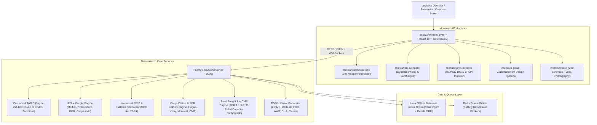

# Atlas Logistics System Architecture

This document provides a comprehensive overview of the architecture, component topology, data persistence, and deterministic calculation engines powering **Atlas Logistics ERP**.

---

## 1. High-Level Architectural Model

Atlas Logistics employs a **Hybrid Micro-Frontend and Fastify Backend** architecture designed for ultra-low latency, zero operational cloud costs ($0 local architecture), and full compliance with international freight forwarding regulations.

---

## 2. Monorepo Topology (Turborepo & pnpm Workspaces)

The codebase is organized into modular packages using `pnpm` workspaces:

| Package | Role | Key Technologies |
|---|---|---|
| **`packages/frontend`** | Main Host Super-App | React 19, Vite 8, React Router 7, TanStack Query, TailwindCSS |
| **`packages/dashboard`** | Operational analytics & KPIs | React 19, Lucide, Recharts |
| **`packages/rate-comparer`** | Multi-carrier ocean/air freight rating | Dynamic rate matrices, BAF/CAF surcharges |
| **`packages/bpmn-modeler`** | Business process modeler & versioning | BPMN 2.0 XML parser, canvas designer |
| **`packages/warehouse-ops`** | Warehouse digital twin & dock traffic | 3D & 2.5D visual rack & pallet management |
| **`packages/ui`** | Reusable design system | Glassmorphism styling tokens, buttons, modal wrappers |
| **`packages/shared`** | Shared utilities and cryptographic security | Zod schemas, DOMPurify, timingSafeEqual |

---

## 3. Backend & API Services (Fastify 5)

The server runtime is built on **Fastify 5**, providing high throughput and native plugin modularity:

- **Authentication & RBAC**: `@fastify/jwt` handles session validation and role authorization across `ADMIN`, `MANAGER`, `OPERATIONS`, `EXECUTIVE`, `SALES`, `CUSTOMER`, and `DRIVER`.
- **Real-Time WebSockets**: `@fastify/websocket` broadcasts instantaneous dispatch, customs status updates, and demurrage alerts.
- **REST Endpoints**:
  - `/api/auth`: Login, user registration, role validation.
  - `/api/customs-declarations`: 54-box DUA declarations, TARIC calculations, DUA XML/PDF.
  - `/api/air-cargo`: e-AWB, Modulo-7 validation, DGR screening, Cargo-XML/IMP.
  - `/api/incoterms`: 11-rule responsibility matrix, customs valuation normalizer, commercial contracts.
  - `/api/claims`: Cargo claims, statutory SDR caps, Carrier Protest Letters, Subrogation Receipts.
  - `/api/road-freight`: e-CMR consignments, ADR 1.1.3.6 points, trailer load %, Carta de Porte PDF.
  - `/api/treasury`: 3-Way Match reconciler, FX risk exposure, cash flow forecast, carrier dispute letters & settlement statements PDF.
  - `/api/cold-chain`: Datalogger telemetry (EN 12830), Arrhenius MKT calculator, Dry Ice holdover, Reefer Genset fuel burn, GDP Release Certificate PDF.
  - `/api/cbam`: CBAM catalog, verified installations, embedded emissions calculation, Article 9 foreign carbon deductions, EU registry XML, and CBAM declaration certificate PDF.
  - `/api/rail`: Corridors TEN-T (RFC4/RFC6), terminals, rolling stock wagons, CIM consignments, train consists (750m), axle loads (EN 15528), braking percentage, ERA TAF-TSI XML, CIM PDF & Brake Sheet PDF.
  - `/api/customs-warehouse`: Facilities (DA/DDA/ADT/ZF), guarantees (AEAT GRN), inventory lots, official stock ledger, debt suspension & discharge tax settlement, DVD PDF, and Stock Certificate PDF.
  - `/api/fueleu`: Marine fuels, merchant vessels, voyages, compliance accounts, fleet pools (Art. 21), EU ETS liability & Green BAF per TEU, EMSA THETIS-MRV XML, FuelEU Compliance Certificate PDF & BDN PDF.

---

## 4. Deterministic Business & Regulatory Engines

All logistics calculations are 100% deterministic, executing strictly defined mathematical and legal formulas:

1. **Customs Valuation Normalization (EU UCC Art. 70–74)**:
   $$\text{CIF Customs Value} = \text{Invoice Price} + \text{Additions (Freight, Origin Terminal, Insurance)} - \text{Deductions (Post-Import Duty, Inland Freight)}$$
2. **IATA Modulo-7 Checksum Verification**:
   $$\text{Checksum} = \text{Serial Number (7 digits)} \pmod 7$$
3. **ADR 2025 Section 1.1.3.6 Small Load Exemption (Puntos ADR)**:
   $$\text{Total Points} = \sum (\text{Quantity (kg/L)} \times \text{Multiplier}) \le 1,000 \implies \text{Exempt from orange plates}$$
4. **Statutory International Carrier Liability Limits (SDR / DEG)**:
   - **Maritime (Hague-Visby)**: $\max(\text{Gross kg} \times 2.00, \; \text{Packages} \times 666.67) \times \text{Rate}_{\text{SDR}\to\text{EUR}}$
   - **Air Cargo (Montreal 1999)**: $\text{Gross kg} \times 22.00 \times \text{Rate}_{\text{SDR}\to\text{EUR}}$
   - **Road Freight (CMR)**: $\text{Gross kg} \times 8.33 \times \text{Rate}_{\text{SDR}\to\text{EUR}}$
   - **Rail Freight (CIM)**: $\text{Gross kg} \times 17.00 \times \text{Rate}_{\text{SDR}\to\text{EUR}}$
5. **Carrier Invoice 3-Way Match & Variance Tolerance Rule**:
   $$\text{Variance} = \text{Billed Amount} - \text{Expected Quote} \implies \text{Within Tolerance if } |\text{Variance}| \le 5.00 \text{ or } \frac{|\text{Variance}|}{\text{Expected}} \le 1.0\%$$
6. **Multi-Currency Treasury Unrealized FX Gain/Loss**:
   $$\text{Unrealized FX}_{\text{EUR}} = \left(\frac{\text{Net Exposure}_{\text{CCY}}}{\text{Spot Rate}_{\text{CCY}}}\right) - \left(\frac{\text{Net Exposure}_{\text{CCY}}}{\text{Book Rate}_{\text{CCY}}}\right)$$
7. **Arrhenius Mean Kinetic Temperature (MKT for Pharma GDP)**:
   $$T_K = \frac{\frac{\Delta H}{R}}{-\ln\left(\frac{\sum_{i=1}^{n} e^{-\frac{\Delta H}{R T_i}}}{n}\right)}, \quad \Delta H = 83.144\text{ kJ/mol}, \; R = 8.314472\text{ J/(mol}\cdot\text{K)}$$
8. **Reefer Genset Diesel Fuel Consumption**:
   $$\text{Fuel Burn Rate (L/hr)} = 1.8 + 0.08 \times |T_{\text{ambient}} - T_{\text{setpoint}}|$$
9. **CBAM Embedded Specific Emissions & Precursor Kinetics (EU Reg. 2023/956)**:
   $$SE_{\text{total}} = SE_{\text{direct}} + SE_{\text{indirect}} + \sum \left( \frac{\text{Masa Precursor } i}{\text{Masa Producto}} \times SE_{\text{precursor } i} \right)$$
   $$\text{Emisiones Integradas Totales } (\text{tCO}_2\text{e}) = \text{Masa Neta (t)} \times SE_{\text{total}}$$
10. **CBAM Article 9 Net Carbon Liability & Foreign Credit**:
    $$\text{Net Carbon Liability (€)} = \max\left(0, \; (\text{Total Embedded } \text{tCO}_2\text{e} \times P_{\text{EU ETS}}) - \text{Foreign Carbon Price Paid (€)}\right)$$
11. **Wagon Axle Load Distribution & Line Class Limits (EN 15528)**:
    $$\text{Axle Load (t/axle)} = \frac{\text{Wagon Tare} + \text{Payload}}{\text{Number of Axles}} \le \text{UIC Limit (A: 16.0t, B: 18.0t, C: 20.0t, D: 22.5t)}$$
12. **TEN-T Rail Freight Braking & Block Train Mass (UIC 992 / ERA TAF-TSI)**:
    $$\text{Braked Mass Percentage (}\lambda\text{)} = \left(\frac{\sum \text{Braked Mass (t)}}{\text{Total Train Weight (t)}}\right) \times 100 \ge 65\%$$
13. **FuelEU Maritime Well-to-Wake (WtW) Energy & GHG Intensity (Regulation (EU) 2023/1805)**:
    $$\text{Energy Used (MJ)} = \sum_{i} \left( M_i \times \text{LCV}_i \right) + E_{\text{OPS}}$$
    $$\text{GHG Intensity (}g\text{CO}_2\text{eq/MJ)} = \frac{\sum_{i} \left( M_i \times \text{LCV}_i \times \text{GHG}_{\text{WtW},i} \right)}{\text{Total Energy Used (MJ)}}$$
    $$\text{Compliance Balance (CB, gCO}_2\text{eq)} = \left(\text{GHG Target} - \text{Actual GHG Intensity}\right) \times \text{Total Energy Used (MJ)}$$
    $$\text{Statutory Penalty (€)} = \frac{|\min(0, \text{CB})|}{\text{Actual GHG Intensity} \times 41,000} \times 2,400\text{ €/t}$$
14. **EU ETS Maritime Multi-Gas Geographic Scope Allocation (Directive (EU) 2023/959)**:
    $$\text{Gross } \text{tCO}_2\text{eq} = \text{CO}_2 + (\text{CH}_4 \times 28) + (\text{N}_2\text{O} \times 265)$$
    $$\text{EU ETS Scope Obligation} = \text{Scope Factor (1.0 Intra-EU / 0.5 Extra-EU)} \times \text{Gross } \text{tCO}_2\text{eq}$$
    $$\text{Green BAF Surcharge (€/TEU)} = \frac{\text{FuelEU Cost/Penalty (€)} + \text{EU ETS Liability (€)}}{\text{Carried TEUs}}$$
15. **Trade Finance UCP 600 Bank Charges & Insurance Formulas (UCP 600 Art. 28 & ISBP 745)**:
    $$\text{Minimum Insured Amount (EUR)} = \text{Invoice CIF Amount} \times 1.10 \quad (\ge 110\%)$$
    $$\text{Opening Fee (€)} = \text{Credit Amount} \times \left(\frac{\text{Opening Rate } \%}{100}\right) \times \left\lceil \frac{\text{Tenor Days}}{90} \right\rceil$$
    $$\text{Confirmation Fee (€)} = \text{Credit Amount} \times \left(\frac{\text{Confirmation Rate } \%}{100}\right) \times \left(\frac{\text{Tenor Days}}{360}\right)$$
16. **AEO / C-TPAT Readiness & Partner Risk Scoring (CAU Art. 39 & ISO 28000)**:
    $$\text{AEO Overall Readiness (\%)} = \sum_{i=1}^{6} \left( w_i \times \text{Score Bloque CAE } i \right) \quad (\ge 85\% \implies \text{Audit Ready})$$
    $$\text{Partner Risk Score} = (0.40 \times \text{Questionnaire}) + 35\text{ (AEO)} + 15\text{ (C-TPAT)} + 10\text{ (ISO 28000)} - 15\text{ (if audit } > 12\text{m)}$$

---

## 5. Persistence & Database Design (Drizzle ORM & SQLite)

The database layer utilizes **libSQL** (`@libsql/client`) with **Drizzle ORM**:
- **Environment Isolation & Resolution**:
  - **Development (`NODE_ENV=development`)**: Automatically targets `file:atlas-erp-v2.db` with local development seed data.
  - **Production (`NODE_ENV=production`)**: Automatically targets `file:atlas-erp-prod.db` with isolated enterprise tables and initialized admin credentials.
  - **Dynamic URI / Cloud Deployment (`DATABASE_URL`)**: Supports overriding with custom file paths (e.g. `/var/data/prod.db`) or remote Turso/libSQL clusters (`libsql://...`) with `DATABASE_AUTH_TOKEN`.
- **96 Relational Tables** mapped with strict TypeScript schemas in `src/db/schema/*.ts`.
- **WAL Journal Mode & Busy Timeout**: High-concurrency transaction resiliency for background jobs and concurrent Fastify requests.
- **Custom SQL Triggers**: Automatic sequential code generators (`CLM-YYYY-XXXX`, `CMR-YYYY-XXXXX`, `DUA-YYYY-XXXX`, `OEA-YYYY-XXXX`) and immutable audit logs.
- **SQL Views**: Aggregated financial summaries and warehouse occupancy metrics.
- **Automated Backup Utility**: Daily snapshot scheduler saving database state to `/backups`.

---

## 6. Testing & Quality Assurance

- **Vitest Suite**: 60 test suites with 293 unit & integration tests covering all deterministic services and Fastify routes with 100% pass rate.
- **Playwright E2E**: End-to-end browser tests verifying user flows across all operational modules.
- **CodeQL SAST**: Continuous security analysis with zero alerts.
