# Atlas Logistics — Camunda 8 BPM Layer (Phase 1 + 2)

## Summary

Built the complete business process automation layer for Atlas Logistics freight forwarding:
**18 BPMN process models** · **8 DMN decision tables** · **10 Camunda Forms** · **18 Zeebe workers** · **25 BPMN error codes**

All resources target the Camunda 8 SaaS cluster in Brussels (`bru-2`).

---

## Architecture Overview

```mermaid
graph TB
    subgraph "Camunda 8 SaaS (bru-2)"
        Engine["Zeebe Engine"]
        Tasklist["Tasklist"]
        Operate["Operate"]
    end
    
    subgraph "BPMN Models"
        Core["Core Transport\n(Ocean Export/Import, Air Export/Import)"]
        Quoting["Quoting\n(Rate Comparison, Quote Lifecycle)"]
        Customs["Customs\n(Clearance)"]
        Docs["Documents\n(Generation, Approval)"]
        Finance["Finance\n(Invoice Handling)"]
        Tracking["Tracking\n(Track & Trace)"]
        Warehouse["Warehouse\n(Receiving, LCL Consolidation)"]
    end
    
    subgraph "Decision Tables"
        DMN1["HS Code Validation"]
        DMN2["Routing Selection"]
        DMN3["Pricing Rules"]
        DMN4["SLA Escalation"]
    end
    
    subgraph "Atlas Backend (18 Workers)"
        W1["Rates (2)"]
        W2["Booking (3)"]
        W3["Customs (3)"]
        W4["Docs (3)"]
        W5["Tracking (2)"]
        W6["Finance (2)"]
        W7["Warehouse (3)"]
    end
    
    Engine --> Core & Quoting & Customs & Docs & Finance & Tracking & Warehouse
    Engine --> DMN1 & DMN2 & DMN3 & DMN4
    Engine --> Tasklist
    W1 & W2 & W3 & W4 & W5 & W6 & W7 --> Engine
```



---

## BPMN Process Models (13)

### Core Transport (7)

| Process | File | Size | Key Features |
|---|---|---|---|
| Ocean Export | [ocean-export.bpmn](file:///C:/Users/xpall/Source/Atlas-Logistics/camunda-config/bpmn/core/ocean-export.bpmn) | 41KB | 80 elements, parallel docs, error boundaries, tracking loop |
| Ocean Import | [ocean-import.bpmn](file:///C:/Users/xpall/Source/Atlas-Logistics/camunda-config/bpmn/core/ocean-import.bpmn) | 21KB | Vessel arrival loop, demurrage PT48H timer, cargo inspection |
| Air Export | [air-export.bpmn](file:///C:/Users/xpall/Source/Atlas-Logistics/camunda-config/bpmn/core/air-export.bpmn) | 16KB | DG handling, airline rejection error, parallel AWB/customs |
| Air Import | [air-import.bpmn](file:///C:/Users/xpall/Source/Atlas-Logistics/camunda-config/bpmn/core/air-import.bpmn) | 14KB | Flight tracking PT4H loop, customs resolution |
| Road Freight | [road-freight-dispatch.bpmn](file:///C:/Users/xpall/Source/Atlas-Logistics/camunda-config/bpmn/core/road-freight-dispatch.bpmn) | ~5KB | Carrier selection DMN, Last-mile sub-process |
| Last Mile Delivery | [last-mile-delivery.bpmn](file:///C:/Users/xpall/Source/Atlas-Logistics/camunda-config/bpmn/core/last-mile-delivery.bpmn) | ~5KB | POD form, Rejected error boundary |
| Hazmat Approval | [hazmat-approval.bpmn](file:///C:/Users/xpall/Source/Atlas-Logistics/camunda-config/bpmn/core/hazmat-approval.bpmn) | ~5KB | IMO/IATA DMN validation, DGD review form |

### Quoting (2)

| Process | File | Size | Key Features |
|---|---|---|---|
| Rate Comparison | [rate-comparison.bpmn](file:///C:/Users/xpall/Source/Atlas-Logistics/camunda-config/bpmn/quoting/rate-comparison.bpmn) | 28KB | Parallel 4-carrier fetch, PT10S timeouts, DMN pricing |
| Quote Lifecycle | [quote-lifecycle.bpmn](file:///C:/Users/xpall/Source/Atlas-Logistics/camunda-config/bpmn/quoting/quote-lifecycle.bpmn) | 19KB | Event-based gateway, PT72H timer, follow-up loop |

### Operations (6)

| Process | File | Size | Key Features |
|---|---|---|---|
| Customs Clearance | [customs-clearance.bpmn](file:///C:/Users/xpall/Source/Atlas-Logistics/camunda-config/bpmn/customs/customs-clearance.bpmn) | 19KB | DMN HS validation, message catch, 3-way customs decision |
| Document Generation | [document-generation.bpmn](file:///C:/Users/xpall/Source/Atlas-Logistics/camunda-config/bpmn/docs/document-generation.bpmn) | 15KB | Parallel HBL/MBL/Manifest generation |
| Document Approval | [document-approval.bpmn](file:///C:/Users/xpall/Source/Atlas-Logistics/camunda-config/bpmn/docs/document-approval.bpmn) | 18KB | Auto-approve path, 2-tier escalation, PT48H timer |
| Track & Trace | [track-and-trace.bpmn](file:///C:/Users/xpall/Source/Atlas-Logistics/camunda-config/bpmn/tracking/track-and-trace.bpmn) | 14KB | AIS polling PT6H, predictive ETA, non-interrupting errors |
| Invoice Handling | [invoice-handling.bpmn](file:///C:/Users/xpall/Source/Atlas-Logistics/camunda-config/bpmn/finance/invoice-handling.bpmn) | 20KB | Parallel AR/AP, vendor matching, P30D payment reminder |
| Vendor Onboarding | [vendor-onboarding.bpmn](file:///C:/Users/xpall/Source/Atlas-Logistics/camunda-config/bpmn/core/vendor-onboarding.bpmn) | ~5KB | Vendor risk DMN, compliance review form, activation task |

### Warehouse (2)

| Process | File | Size | Key Features |
|---|---|---|---|
| Warehouse Receiving | [warehouse-receiving.bpmn](file:///C:/Users/xpall/Source/Atlas-Logistics/camunda-config/bpmn/warehouse/warehouse-receiving.bpmn) | 18KB | Document verification loop, damage inspection/claims |
| LCL Consolidation | [lcl-consolidation.bpmn](file:///C:/Users/xpall/Source/Atlas-Logistics/camunda-config/bpmn/warehouse/lcl-consolidation.bpmn) | 18KB | Container optimization, overweight error, VGM sealing |

### Claims Management (1)

| Process | File | Size | Key Features |
|---|---|---|---|
| Cargo Claim | [cargo-claim-handling.bpmn](file:///C:/Users/xpall/Source/Atlas-Logistics/camunda-config/bpmn/claims/cargo-claim-handling.bpmn) | ~5KB | Claim review form, Liability DMN, Insurance decision |

---

## DMN Decision Tables (8)

| Decision | File | Hit Policy | Rules | Purpose |
|---|---|---|---|---|
| HS Code Validation | [customs-hs-validation.dmn](file:///C:/Users/xpall/Source/Atlas-Logistics/camunda-config/dmn/customs-hs-validation.dmn) | FIRST | 8 | Embargo, weapons, alcohol, dual-use, pharma, hazmat |
| Routing Selection | [routing-selection.dmn](file:///C:/Users/xpall/Source/Atlas-Logistics/camunda-config/dmn/routing-selection.dmn) | FIRST | 8 | Transport mode, container type, transit time |
| Pricing Rules | [pricing-rules.dmn](file:///C:/Users/xpall/Source/Atlas-Logistics/camunda-config/dmn/pricing-rules.dmn) | COLLECT | 8 | Customer tier, volume, contract, seasonality adjustments |
| SLA Escalation | [sla-escalation.dmn](file:///C:/Users/xpall/Source/Atlas-Logistics/camunda-config/dmn/sla-escalation.dmn) | FIRST | 6 | P1→P4 escalation by delay, priority, customer tier |
| Carrier Selection | [carrier-selection.dmn](file:///C:/Users/xpall/Source/Atlas-Logistics/camunda-config/dmn/carrier-selection.dmn) | FIRST | 4 | Land carrier selection based on region and hazmat |
| Claim Liability | [claim-liability.dmn](file:///C:/Users/xpall/Source/Atlas-Logistics/camunda-config/dmn/claim-liability.dmn) | FIRST | 4 | Resolve liability party based on claim type & location |
| Hazmat Validation | [hazmat-validation.dmn](file:///C:/Users/xpall/Source/Atlas-Logistics/camunda-config/dmn/hazmat-validation.dmn) | FIRST | 4 | Prohibit Class 1 Air, Route Class 7, Approve Class 3/8 Ocean |
| Vendor Risk | [vendor-risk.dmn](file:///C:/Users/xpall/Source/Atlas-Logistics/camunda-config/dmn/vendor-risk.dmn) | FIRST | 4 | Evaluate risk level by years in business, insurance, safety |

---

## Camunda Forms (10)

| Form | File | User Tasks |
|---|---|---|
| [booking-request.form](file:///C:/Users/xpall/Source/Atlas-Logistics/camunda-config/forms/booking-request.form) | Parties, routing, cargo, incoterms | New shipment request |
| [quote-approval.form](file:///C:/Users/xpall/Source/Atlas-Logistics/camunda-config/forms/quote-approval.form) | Financials, approve/revise/reject | Internal quote review |
| [customs-review.form](file:///C:/Users/xpall/Source/Atlas-Logistics/camunda-config/forms/customs-review.form) | HS code, restrictions, license input | Customs restriction review |
| [cargo-inspection.form](file:///C:/Users/xpall/Source/Atlas-Logistics/camunda-config/forms/cargo-inspection.form) | Condition, pieces, damage report | Warehouse receiving |
| [invoice-review.form](file:///C:/Users/xpall/Source/Atlas-Logistics/camunda-config/forms/invoice-review.form) | Variance, accept/dispute/split | AP discrepancy review |
| [document-approval.form](file:///C:/Users/xpall/Source/Atlas-Logistics/camunda-config/forms/document-approval.form) | Doc details, approve/escalate/reject | Document approval workflow |
| [proof-of-delivery.form](file:///C:/Users/xpall/Source/Atlas-Logistics/camunda-config/forms/proof-of-delivery.form) | Delivery status, receiver details | Last mile delivery proof |
| [cargo-claim.form](file:///C:/Users/xpall/Source/Atlas-Logistics/camunda-config/forms/cargo-claim.form) | Claim incident details | Exception and damage claims |
| [hazmat-dgd.form](file:///C:/Users/xpall/Source/Atlas-Logistics/camunda-config/forms/hazmat-dgd.form) | UN number, IMO class, packing group | Dangerous Goods Declaration |
| [vendor-compliance.form](file:///C:/Users/xpall/Source/Atlas-Logistics/camunda-config/forms/vendor-compliance.form) | Metrics, risk level, decision | Vendor compliance review |

---

## Zeebe Workers (18)

All workers extend [AtlasWorker](file:///C:/Users/xpall/Source/Atlas-Logistics/src/bpm/utils/worker-base.ts) providing structured logging, BPMN error handling, exponential retry backoff, and DB access.

| Module | Worker | Task Type | File |
|---|---|---|---|
| **Rates** | Fetch Rates | `atlas.rates.fetch` | [fetch-rates.worker.ts](file:///C:/Users/xpall/Source/Atlas-Logistics/src/bpm/workers/rates/fetch-rates.worker.ts) |
| | Compare Rates | `atlas.rates.compare` | [compare-rates.worker.ts](file:///C:/Users/xpall/Source/Atlas-Logistics/src/bpm/workers/rates/compare-rates.worker.ts) |
| **Booking** | Validate | `atlas.booking.validate` | [validate-booking.worker.ts](file:///C:/Users/xpall/Source/Atlas-Logistics/src/bpm/workers/booking/validate-booking.worker.ts) |
| | Confirm | `atlas.booking.confirm` | [confirm-booking.worker.ts](file:///C:/Users/xpall/Source/Atlas-Logistics/src/bpm/workers/booking/confirm-booking.worker.ts) |
| | Notify | `atlas.notify.parties` | [notify-parties.worker.ts](file:///C:/Users/xpall/Source/Atlas-Logistics/src/bpm/workers/booking/notify-parties.worker.ts) |
| **Customs** | Validate HS | `atlas.customs.validate-hs` | [validate-hs-code.worker.ts](file:///C:/Users/xpall/Source/Atlas-Logistics/src/bpm/workers/customs/validate-hs-code.worker.ts) |
| | Submit Decl. | `atlas.customs.submit-declaration` | [submit-declaration.worker.ts](file:///C:/Users/xpall/Source/Atlas-Logistics/src/bpm/workers/customs/submit-declaration.worker.ts) |
| | Restrictions | `atlas.customs.check-restrictions` | [check-restrictions.worker.ts](file:///C:/Users/xpall/Source/Atlas-Logistics/src/bpm/workers/customs/check-restrictions.worker.ts) |
| **Docs** | HBL | `atlas.docs.generate-hbl` | [generate-hbl.worker.ts](file:///C:/Users/xpall/Source/Atlas-Logistics/src/bpm/workers/docs/generate-hbl.worker.ts) |
| | MBL | `atlas.docs.generate-mbl` | [generate-mbl.worker.ts](file:///C:/Users/xpall/Source/Atlas-Logistics/src/bpm/workers/docs/generate-mbl.worker.ts) |
| | Manifest | `atlas.docs.generate-manifest` | [generate-manifest.worker.ts](file:///C:/Users/xpall/Source/Atlas-Logistics/src/bpm/workers/docs/generate-manifest.worker.ts) |
| **Tracking** | Update Status | `atlas.tracking.update-status` | [update-status.worker.ts](file:///C:/Users/xpall/Source/Atlas-Logistics/src/bpm/workers/tracking/update-status.worker.ts) |
| | Check AIS | `atlas.tracking.check-ais` | [check-ais.worker.ts](file:///C:/Users/xpall/Source/Atlas-Logistics/src/bpm/workers/tracking/check-ais.worker.ts) |
| **Finance** | Invoice | `atlas.invoice.generate` | [generate-invoice.worker.ts](file:///C:/Users/xpall/Source/Atlas-Logistics/src/bpm/workers/finance/generate-invoice.worker.ts) |
| | Reconcile | `atlas.invoice.reconcile-costs` | [reconcile-costs.worker.ts](file:///C:/Users/xpall/Source/Atlas-Logistics/src/bpm/workers/finance/reconcile-costs.worker.ts) |
| **Warehouse** | Gate-In | `atlas.warehouse.gate-in` | [receive-cargo.worker.ts](file:///C:/Users/xpall/Source/Atlas-Logistics/src/bpm/workers/warehouse/receive-cargo.worker.ts) |
| | Optimize LCL | `atlas.lcl.optimize-loading` | [optimize-loading.worker.ts](file:///C:/Users/xpall/Source/Atlas-Logistics/src/bpm/workers/warehouse/optimize-loading.worker.ts) |
| | Seal Container | `atlas.lcl.seal-container` | [seal-container.worker.ts](file:///C:/Users/xpall/Source/Atlas-Logistics/src/bpm/workers/warehouse/seal-container.worker.ts) |

---

## Infrastructure

| Component | File | Purpose |
|---|---|---|
| Worker Base | [worker-base.ts](file:///C:/Users/xpall/Source/Atlas-Logistics/src/bpm/utils/worker-base.ts) | Abstract class with logging, error handling, retry backoff |
| Error Codes | [error-codes.ts](file:///C:/Users/xpall/Source/Atlas-Logistics/src/bpm/utils/error-codes.ts) | 25 BPMN error codes mapped to boundary events |
| Worker Registry | [index.ts](file:///C:/Users/xpall/Source/Atlas-Logistics/src/bpm/workers/index.ts) | `registerAllWorkers()` — 18 workers |
| Deploy Script | [deploy.ts](file:///C:/Users/xpall/Source/Atlas-Logistics/camunda-config/deploy.ts) | Deploys all BPMN/DMN/Forms to Camunda SaaS |
| Bootstrap | [index.ts](file:///C:/Users/xpall/Source/Atlas-Logistics/src/index.ts) | Updated to call `registerAllWorkers()` |

---

## Deployment

```bash
# Preview (lists files without deploying)
npx tsx camunda-config/deploy.ts --dry-run

# Deploy to Camunda 8 SaaS cluster
npx tsx camunda-config/deploy.ts
```
